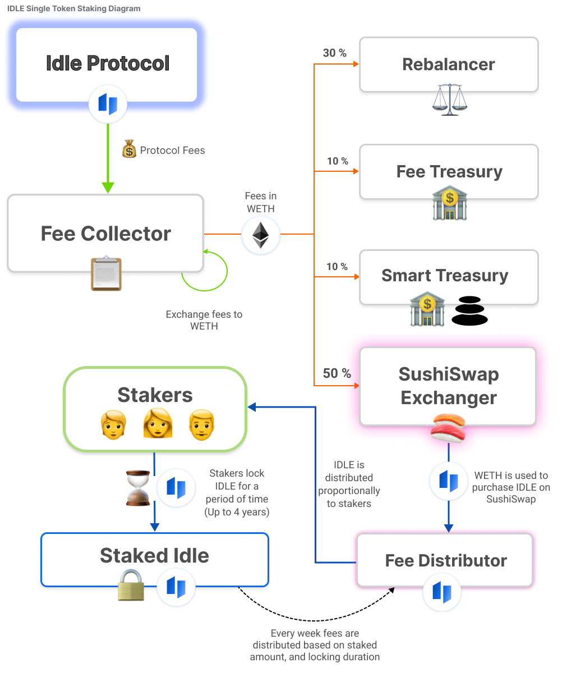

# IDLE Staking Contracts

This repo contains the idle single token staking smart contracts. The staking contracts are based on the curve staking contracts and are located under `./contracts/curve/`. These contracts have been slightly modified to be compatiable with the idle token.

stkIDLE is a given to stakers based the amount of IDLE they stake, and for how long they stake. Stakers stkIDLE balance decreases linearly from the lock date, untill the unlock date. Stakers can choose to either lock more IDLE, or increase the unlock duration to increase their stkIDLE balance. The following [staking calculator](https://docs.google.com/spreadsheets/d/12JBKXGaicbOm45ttneUyyXtStMxzIYATvpvMjOHXABI/edit?usp=sharing) has been developed to help calculate potential.rewards

The diagram below illustrates at a high level how the staking contracts interact with the IDLE ecosystem.

Idle tokens which have been staked are vote delegated to the [idle staking multisig](https://gnosis-safe.io/app/#/safes/0xb08696Efcf019A6128ED96067b55dD7D0aB23CE4/balances).

## Deployed Addresses
- stakedIDLE-  [0xaac13a116ea7016689993193fce4badc8038136f](https://etherscan.io/address/0xaac13a116ea7016689993193fce4badc8038136f)
- feeDistributor - [0xbabb82456c013fd7e3f25857e0729de8207f80e2](https://etherscan.io/address/0xbabb82456c013fd7e3f25857e0729de8207f80e2)
- feeExchanger - [0x1594375eee2481ca5c1d2f6ce15034816794e8a3](https://etherscan.io/address/0x1594375eee2481ca5c1d2f6ce15034816794e8a3)

Other addresses
- feeExchangerProxyAdmin - [0x6ba1dacc73a8fbb2f4f85361a374257dd5d7d0fa](https://etherscan.io/address/0x6ba1dacc73a8fbb2f4f85361a374257dd5d7d0fa)
- feeExchangerImp - [0x8fa248e22655622581be74484b92b01207ce1905](https://etherscan.io/address/0x8fa248e22655622581be74484b92b01207ce1905)
- Staking Multisig - [0xb08696efcf019a6128ed96067b55dd7d0ab23ce4](https://etherscan.io/address/0xb08696efcf019a6128ed96067b55dd7d0ab23ce4)

## Installation
This project was developed using hardhat. Due to some [issues with the vyper plugin](https://github.com/nomiclabs/hardhat/issues/1364) this project does not currently build on windows.

1. `npm install -i`
2. Create `.env` file from `.env.template`

For local testing you only need to populate the `ALCHEMY_API_KEY` key, the rest are optional.

## Running Unit Tests
Unit tests are defined under `./test` and can be executed by calling. These scripts verify the functionality of the contracts using mock contracts.

`npx hardhat test`

## Running Fork Tests
A number of fork tests are defined under `./scripts`. These scripts verify that the contracts deployed on mainnet interact correctly.

The can be run by executing: 
`npx hardhat run scripts/<scriptname>`

## Deployment
The deployment scripts are located under `./deploy`

These script can be run on a local fork, or on mainnet.
The behaviour of these scripts will slightly change when running on mainnet. Scripts which fund test accounts will not execute on mainnet deployment.

`npx hardhat deploy --network <network_name>`

Mainnet deployment meta data is stored under `deployments/mainnet/`

## Tasks
This repo also defines a number of tasks which are helpful for local testing. They are located under `./tasks`.

These scripts use the default signers from `ethers.getSigners()`

The following tasks are available
- `npx hardhat mockdeploy` Deploys the contracts to a local fork.
- `npx hardhat sendidle` Sends idle. You can specify which account to send funds to by including `--signernum`.
- `npx hardhat stake` Stakes some idle. use `--stkidle` to specify a staking contract address.
- `npx hardhat stakebalance` Print info on current stake.
- `npx hardhat topup` Send some idle to the feeDistributor. use `--feedistributor` to specify a fee distributor address. 
- `npx hardhat claimbalance` Print info on how much fees an account can claim from feeDistributor.
